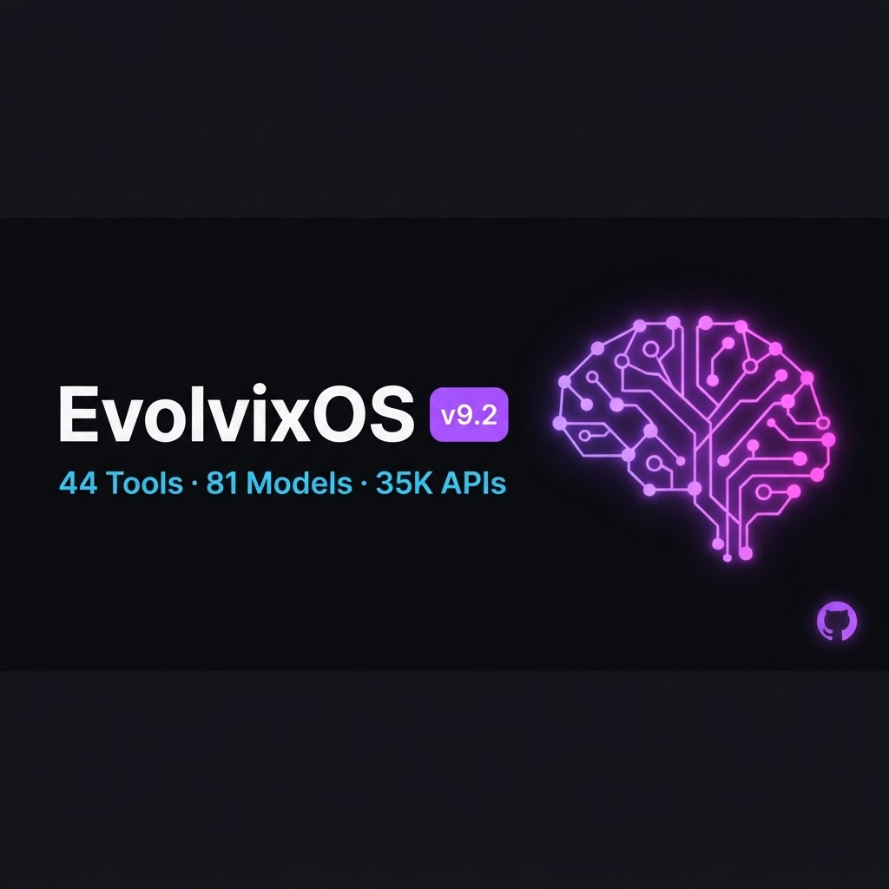

<div align="center">



# 🧬 EvolvixOS v9.2

**The open-source, self-hosted AI engineering platform.**

`100% local core` · `zero paid tokens` · `44 tools` · `81 models` · `35K APIs`

[](https://github.com/Protremix/EvolvixOS/stargazers)
[](https://github.com/Protremix/EvolvixOS/network/members)
[](LICENSE)
[](https://github.com/Protremix/EvolvixOS/issues)
[](https://github.com/Protremix/EvolvixOS/commits)

[🌐 Live Platform](https://evolvixos.com) · [📚 Docs](https://protremix.github.io/EvolvixOS/) · [🎨 Studio](https://evolvixos.com/studio) · [📦 Models](https://evolvixos.com/models) · [🔑 Developer Portal](https://evolvixos.com/developer)

</div>

---

## ✨ What is EvolvixOS?

EvolvixOS is a fully self-hosted AI engineering platform that runs on a single server. It features **Mr James** — an autonomous AI agent with 44 tools, triple-brain routing (Groq + Gemini + Kimi), and access to 35,277 searchable APIs. Zero paid tokens for core logic. Everything runs locally with optional external AI engines for speed and multimodal capabilities.

## 🧠 Triple-Brain Routing

Mr James automatically selects the best AI engine for each task:

<div align="center">

| Engine | Model | Speed | Context | Primary Use |
|:------:|:------|:------:|:-------:|:------------|
| 🟢 Groq | `gpt-oss-120b` | **467 tok/s** | 128K | Tool-use precision, agentic execution |
| 🔵 Gemini | `gemini-3.6-flash` | Fast | 1M | Vision, multimodal, TTS, large context |
| 🟡 Kimi | `moonshot-v1-32k` | Medium | 32K | Complex reasoning fallback |
| ⚪ Ollama | `qwen2.5:14b/7b/3b` | CPU | 32K | Local, offline, zero-cost fallback |

</div>

## 🔧 44 Tools

<details open>
<summary><b>Click to expand full tool list</b></summary>

| Category | Count | Tools |
|:---------|:-----:|:------|
| 📁 File Operations | 6 | `file_read`, `file_write`, `file_edit`, `file_list`, `file_delete`, `code_analyze` |
| 💻 Code Execution | 3 | `python_exec`, `bash_exec`, `sandbox_exec` (CubeSandbox MicroVM) |
| 🤖 AI / LLM | 4 | `call_free_llm`, `gemini_vision`, `gemini_tts`, `file_upload` |
| 🌐 Smart API | 3 | `api_auto_route` (35K APIs), `smart_api_call`, `http_request` |
| ☁️ Tencent Cloud | 1 | `tencent_cloud` (CVM, CDB, VPC, SSL, DNSPod, CDN, Billing, CAM, Hunyuan, AIArt) |
| 💬 TIMSDK Chat | 4 | `tim_send_message`, `tim_create_group`, `tim_send_group_message`, `tim_import_user` |
| 🧠 Team Memory | 2 | `team_memory_search`, `team_memory_save` (TencentDB) |
| 🎭 Agent Library | 2 | `search_subagents` (217 templates), `set_persona` (16 MBTI types) |
| ⚙️ System | 3 | `get_system_info`, `manage_services`, `get_service_logs` |
| 🔧 Other | 16 | `web_search`, `image_gen`, and more |

</details>

## 🏗️ Architecture

```
┌─────────────────────────────────────────────────────────────────┐
│                      EvolvixOS v9.2 Platform                     │
├──────────────────┬──────────────────┬───────────────────────────┤
│   Mr James v9.2   │    Model API     │      Auth API             │
│   44 tools        │    :5010         │      :5000                │
│   Triple-brain    │    81 models     │      JWT + OTP            │
│   routing         │    Groq+Gemini   │      SHA-256 API keys     │
│                   │    +Kimi+Ollama  │      Rate limiting        │
├──────────────────┼──────────────────┼───────────────────────────┤
│  Discovery Engine │  Dashboard       │   Developer Portal        │
│  Hourly GitHub    │  evolvixos.com   │   /developer              │
│  4 repos synced   │  /studio         │   API key management      │
│  35K APIs indexed │  /models         │   API documentation       │
├──────────────────┴──────────────────┴───────────────────────────┤
│                     Backend Services                             │
├───────────────┬──────────────┬──────────────┬───────────────────┤
│ TencentDB     │ CubeSandbox  │  TIMSDK      │  Octop            │
│ Agent Memory   │ MicroVM      │  Chat SDK    │  217 subagents    │
│ 3 containers   │ (Docker)     │  1K MAU     │  16 MBTI profiles │
├───────────────┴──────────────┴──────────────┴───────────────────┤
│                   Tencent Cloud SDK                              │
│   Go binary (tccli 9.3MB) + Python SDK (12 services)             │
│   CVM · CDB · VPC · SSL · DNSPod · CDN · Billing · CAM · Hunyuan │
├──────────────────────────────────────────────────────────────────┤
│              Infrastructure (16 systemd services)                 │
│  Nginx HTTPS · Let's Encrypt SSL · Ollama · Docker              │
│  Server: Hetzner Cloud (16 vCPU, 30GB RAM, 600GB disk)          │
└──────────────────────────────────────────────────────────────────┘
```

## 🔌 Integrations

### ☁️ Tencent Cloud SDK
- **Go binary** (`tccli`, 9.3MB): 7 services, 14 actions
- **Python SDK**: 12 services — comprehensive API coverage
- **Services**: CVM, CDB, VPC, SSL, DNSPod, CDN, Billing, CAM, Hunyuan, AIArt
- **Config**: `TENCENTCLOUD_SECRET_ID` + `TENCENTCLOUD_SECRET_KEY`

### 🤖 Octop — Self-Hosted AI Assistant
- **217 subagent templates** across 16 categories (Engineering: 33, Specialized: 53, Marketing: 36, Security: 10)
- **16 MBTI personality profiles** with behavior mappings
- **10 expert agent templates**
- **SSRF Guard** (CWE-918 mitigation)

### 📦 CubeSandbox — MicroVM Execution
- Isolated code execution sandbox for AI agents
- Docker fallback mode (KVM not available on Hetzner Cloud)
- Pre-installed: numpy, pandas, scikit-learn, matplotlib
- Full MicroVM mode on CCX dedicated CPU servers

### 💬 TIMSDK — Real-Time Messaging
- Tencent IM SDK · 1,000 MAU free tier · REST API + Web UIKit
- **Config**: `TIM_SDK_APP_ID` + `TIM_SECRET_KEY`

### 🧠 TencentDB Agent Memory
- 3 Docker containers (core:8420, hub:8125, proxy:8096)
- Team memory with full-text search
- Powered by Groq for memory processing

### ✨ Google Gemini 3.6 Flash
- 37 models · 1M context · Vision + Multimodal + TTS
- `gemini_vision`: image analysis, OCR, chart reading
- `gemini_tts`: text-to-speech

### ⚡ Groq Integration
- gpt-oss-120b at 467 tok/s
- Primary execution engine for agentic tool-use
- Auto-fallback to Ollama when overloaded

## 🔍 Discovery Engine

Hourly GitHub scans across 4 repositories — **35,277 APIs indexed**:

| Repository | Content | Count |
|:-----------|:--------|:-----:|
| OpenClaw API Directory | APIs across 18 categories | 25,822 |
| API Mega List | Public API registries | 7,000+ |
| AI Agent Tools | Tools for AI agent development | 84 |
| Free LLM APIs | Models across 31 providers | 442+ |

## 🌐 API Reference

<details>
<summary><b>Click to expand API endpoints</b></summary>

| Endpoint | Method | Auth | Description |
|:---------|:-------|:----:|:------------|
| `/api/health` | `GET` | — | System health check |
| `/api/agent/stream` | `POST` | JWT/API | Streaming agent response |
| `/api/agent` | `POST` | JWT/API | Non-streaming agent response |
| `/api/models` | `GET` | — | List all registered models |
| `/api/upload` | `POST` | JWT | File upload (50MB max, multipart) |
| `/api/docs` | `GET` | — | API documentation |
| `/auth/register` | `POST` | — | User registration (OTP) |
| `/auth/login` | `POST` | — | User login (OTP) |
| `/auth/api-keys/generate` | `POST` | JWT | Generate API key |
| `/auth/api-keys/list` | `GET` | JWT | List API keys |
| `/auth/api-keys/revoke` | `DELETE` | JWT | Revoke API key |
| `/auth/api-keys/usage` | `GET` | JWT | API key usage stats |

</details>

## 🔐 Security

| Feature | Details |
|:--------|:--------|
| Authentication | JWT tokens with OTP verification |
| API Keys | SHA-256 hashed, `evx_` prefix, per-user |
| Rate Limiting | 30/min per IP, 100/min per API key |
| SSRF Guard | CWE-918 mitigation (ported from Octop) |
| Shell Injection | shlex.split, shell=False |
| Error Handling | 21 blocks patched |

## 📦 Frontend Pages

| Page | URL | Description |
|:-----|:---:|:------------|
| Landing | `/` | Platform overview with architecture |
| Studio | `/studio` | Zero-knowledge dashboard |
| Models | `/models` | Visual model browser (81 models, 8 categories) |
| APIs | `/apis` | Searchable API directory (35K APIs) |
| Learn | `/learn` | Learning Hub (19-module full-stack course) |
| Developer | `/developer` | API key management & docs |
| Auth | `/auth` | Login/signup with OTP |
| Memory | `memory.evolvixos.com` | Team memory panel |

## 🚀 Quick Start

```bash
# Clone
git clone https://github.com/Protremix/EvolvixOS.git
cd EvolvixOS

# Deploy (requires Ubuntu 22.04+)
chmod +x gpu_deploy.sh
./gpu_deploy.sh

# Or manual setup
pip3 install -r requirements.txt
python3 models/model_api.py &  # Model API on :5010
python3 auth/auth_api.py &      # Auth API on :5000
python3 dashboard/server.py &   # Dashboard on :8080
```

## ⚙️ Configuration

```bash
# Required for core
export JWT_SECRET="your-secret"

# Optional: External AI brains
export GROQ_API_KEY="your-groq-key"
export GEMINI_API_KEY="your-gemini-key"
export KIMI_API_KEY="your-kimi-key"

# Optional: Tencent Cloud
export TENCENTCLOUD_SECRET_ID="your-id"
export TENCENTCLOUD_SECRET_KEY="your-key"

# Optional: Tencent IM
export TIM_SDK_APP_ID="your-app-id"
export TIM_SECRET_KEY="your-secret"
```

## 📊 Platform Stats

<div align="center">

| | |
|:---|:---|
| **Models** | 81 registered (Ollama + Discovery + Built-in) |
| **APIs/Tools** | 35,277 searchable across 33 categories |
| **Services** | 16 systemd services (all stable) |
| **Server** | Hetzner Cloud (16 vCPU, 30GB RAM, 600GB disk) |
| **Stack** | Python 3.14, Go 1.23.4, Nginx, Docker, systemd |
| **SSL** | Let's Encrypt (valid until Nov 2026) |

</div>

## 🤝 Contributing

Contributions are welcome! Please read the [contributing guidelines](CONTRIBUTING.md) first.

## 📄 License

[MIT](LICENSE) — EvolvixOS is free and open-source software.

<div align="center">

**[⭐ Star](https://github.com/Protremix/EvolvixOS)** · **[🍴 Fork](https://github.com/Protremix/EvolvixOS/fork)** · **[📖 Docs](https://protremix.github.io/EvolvixOS/)** · **[🌐 Live](https://evolvixos.com)**

</div>
