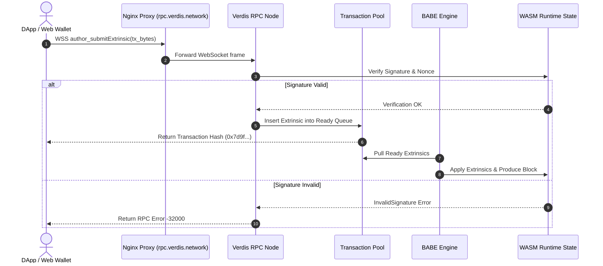

# VERDIS GOVERNANCE DOCUMENT 08: DOCUMENTATION STANDARDS

**Document Reference:** VERDIS-GOV-08  
**Status:** PERMANENT GOVERNANCE STANDARD  
**Version:** 1.0.0  
**Ratified:** August 5, 2026  
**Scope:** All Technical Documentation, Architecture Specs, API References, Code Inline Comments, User Guides, Tutorials, and Whitepapers across the Verdis Ecosystem.

---

## 1. OVERVIEW AND MANDATE

### 1.1 Purpose
This document establishes the official documentation standards for the Verdis Ecosystem. High-quality, comprehensive, and runnable technical documentation is a core requirement for developer adoption and system maintainability. No feature, module, API, or release is considered complete without meeting these documentation standards.

### 1.2 Scope
These documentation standards apply to all repositories, libraries, smart contracts, APIs, user applications, and developer tools across all seven Verdis products:
1. **Verdis Chain** (Consensus, Smart Contracts, Substrate Runtime, RPC, SDK, CLI)
2. **AegisOS Engine** (AI Agents, Workflows, Quality Gates, Orchestration)
3. **Verdis Applications** (Web Wallet, Explorer, Mobile Apps, Desktop Clients)
4. **Verdis Trust Layer** (Identity, Signatures, Verification, Audit Logs)
5. **Verdis Developer Cloud** (Container Platform, RPC Hosting, CI/CD)
6. **Verdis Marketplace** (Plugins, AI Agents, Extensions, Themes)
7. **Verdis Developer Platform** (SDKs, REST, GraphQL, WebSocket, Tutorials)

---

## 2. DOCUMENTATION TYPES & CLASSIFICATION

All documentation in the Verdis Ecosystem is categorized into five distinct tiers, each with specific target audiences and structural mandates.

| Doc Type | Primary Audience | Core Objective | Storage Location / URL | Format & Engine |
| :--- | :--- | :--- | :--- | :--- |
| **1. Architecture Docs** | Core Engineers, Architects | System design, data flow, state machines, protocol specs | `/docs/architecture/`, `docs.verdis.network` | Markdown + Mermaid diagrams |
| **2. API References** | Third-party Devs, Integrators | Exhaustive endpoint specs, inputs, responses, error codes | `api-docs.html`, `api.verdis.network` | OpenAPI 3.0 / AsyncAPI / TypeDoc |
| **3. User Guides** | End Users, Node Operators | Step-by-step product walkthroughs, setup guides, FAQs | `docs.verdis.network/guides/` | Markdown + Screenshots |
| **4. Ecosystem Whitepaper**| Investors, Researchers, Community| Economic model, consensus theory, cryptographic proofs | `VERDIS_WHITEPAPER.md`, `verdis.network/whitepaper` | Formal Markdown / LaTeX PDF |
| **5. Developer Tutorials**| SDK Developers, DApp Builders | End-to-end runnable tutorials, smart contract guides | `docs.verdis.network/tutorials/` | Runnable Markdown + Test Suites |

---

## 3. FORMAT & SYNTAX SPECIFICATIONS

### 3.1 GitHub Flavored Markdown (GFM)
All standalone documentation files must be written in valid GitHub Flavored Markdown (GFM). Standard Markdown features required include:
- Strict heading hierarchy (H1 `#` -> H2 `##` -> H3 `###`). Skipping heading levels (e.g., H1 directly to H3) is forbidden.
- Explicit language tags on all code blocks (e.g., ```rust, ```typescript, ```bash, ```json, ```ini, ```yaml).
- Standardized tables with explicit column alignments.

### 3.2 Code Inline Documentation (Rustdoc & JSDoc / TSDoc)

#### 3.2.1 Rust Inline Code Documentation Standards (Rustdoc)
All public modules, structs, enums, traits, functions, and macros in Rust crates must be documented using triple-slash (`///`) Rustdoc comments. Every function doc must contain:
1. **Overview**: One-line summary of what the function does.
2. **Arguments (`# Arguments`)**: Description of every input parameter.
3. **Returns (`# Returns` or `# Errors`)**: Description of return values or explicit conditions under which an error is returned.
4. **Examples (`# Examples`)**: Runnable doctests that are automatically validated via `cargo test --doc`.

```rust
/// Submits a signed transaction extrinsic to the Verdis transaction pool.
///
/// This function verifies the cryptographic signature of the sender, checks nonce
/// ordering, verifies token balance sufficiency, and broadcasts the extrinsic to P2P peers.
///
/// # Arguments
///
/// * `origin` - The raw origin caller account submitting the extrinsic.
/// * `target` - The destination Verdis AccountId receiving the transfer.
/// * `amount` - The transaction value in VRDX micro-units (1 VRDX = 1,000,000 uVRDX).
///
/// # Returns
///
/// Returns `DispatchResult` indicating successful pool inclusion or dispatch error.
///
/// # Errors
///
/// * `Error::<T>::InsufficientBalance` - Sender account balance is below amount + fee.
/// * `Error::<T>::InvalidSignature` - Cryptographic signature check failed.
/// * `Error::<T>::NonceTooLow` - Extrinsic nonce is behind current account nonce state.
///
/// # Examples
///
/// ```rust
/// use verdis_runtime::balances::Pallet;
/// let result = Pallet::<Runtime>::transfer(origin, recipient, 500_000);
/// assert!(result.is_ok());
/// ```
pub fn transfer(
    origin: OriginFor<T>,
    target: T::AccountId,
    #[compact] amount: T::Balance,
) -> DispatchResult {
    // Implementation
}
```

#### 3.2.2 TypeScript / JavaScript Inline Documentation (TSDoc)
All TypeScript interfaces, functions, classes, and exported APIs must use formal JSDoc / TSDoc syntax:

```typescript
/**
 * Queries the current state of a block by hash or height from the Verdis RPC gateway.
 *
 * @param blockId - The 32-byte hex block hash or integer block height number.
 * @param includeTransactions - Optional flag to expand full transaction objects (default: true).
 * @returns A promise resolving to the canonical {@link VerdisBlock} structure.
 *
 * @throws {@link RpcConnectionError} When the RPC gateway is unreachable or drops connection.
 * @throws {@link BlockNotFoundError} When no block matching blockId exists in chain history.
 *
 * @example
 * ```typescript
 * const client = new VerdisRpcClient('https://rpc.verdis.network');
 * const block = await client.getBlock(1482910, true);
 * console.log(`Block Hash: ${block.hash}, Tx Count: ${block.transactions.length}`);
 * ```
 */
export async function getBlock(
  blockId: string | number,
  includeTransactions = true
): Promise<VerdisBlock> {
  // Implementation
}
```

---

## 4. STANDARDIZED API SPECIFICATION FORMATS

API references must follow machine-readable schema definitions (OpenAPI 3.0 for REST and AsyncAPI for WebSocket streams).

### 4.1 OpenAPI 3.0 REST Specification Example

```yaml
openapi: 3.0.3
info:
  title: Verdis Core API Gateway
  description: High-performance REST API for querying Verdis chain state, AegisOS jobs, and wallet identity.
  version: 1.2.0
servers:
  - url: https://api.verdis.network/v1
    description: Production API Gateway
paths:
  /blocks/{block_id}:
    get:
      summary: Retrieve Block Details
      description: Returns canonical block header, consensus slot metadata, and transaction extrinsic list.
      parameters:
        - name: block_id
          in: path
          required: true
          description: Block height integer (e.g. 1482910) or 32-byte hex hash.
          schema:
            type: string
      responses:
        '200':
          description: Block query successful
          content:
            application/json:
              schema:
                $ref: '#/components/schemas/BlockResponse'
        '404':
          description: Block not found in chain history
components:
  schemas:
    BlockResponse:
      type: object
      required:
        - height
        - hash
        - parent_hash
        - state_root
        - tx_count
      properties:
        height:
          type: integer
          example: 1482910
        hash:
          type: string
          example: "0x8f3a2b91c02e4f7a..."
        parent_hash:
          type: string
          example: "0x1234567890abcdef..."
        state_root:
          type: string
          example: "0xfedcba0987654321..."
        tx_count:
          type: integer
          example: 142
```

---

## 5. ARCHITECTURAL DIAGRAMMING STANDARDS

Architectural documentation must include visual sequence and flowchart diagrams rendered using Mermaid.js syntax.

### 5.1 Mermaid.js Sequence Diagram Example



---

## 6. WHITEPAPER & MATHEMATICAL SPECIFICATIONS

The Ecosystem Whitepaper (`VERDIS_WHITEPAPER.md`) defines the theoretical, economic, and cryptographic foundations of the network.

### 6.1 Mathematical & Cryptographic Notation Rules
1. **Equations**: Render mathematical equations using LaTeX syntax enclosed in `$ ... $` for inline equations and `$$ ... $$` for display blocks.
2. **Variables**: Explicitly define every variable used in tokenomic or consensus formulas immediately below the equation.

$$TPS = \min\left( rac{B_{	ext{max\_bytes}}}{S_{	ext{avg\_tx\_bytes}}}, rac{T_{	ext{slot\_limit}}}{t_{	ext{execution\_avg}}} 
ight)$$

*Where:*
- $B_{	ext{max\_bytes}}$ = Maximum block size in bytes (2,097,152 bytes / 2MB).
- $S_{	ext{avg\_tx\_bytes}}$ = Average transaction size in bytes (~256 bytes).
- $T_{	ext{slot\_limit}}$ = Block execution CPU time limit (500ms).
- $t_{	ext{execution\_avg}}$ = Average transaction execution duration (0.2ms).

---

## 7. DEVELOPER TUTORIAL AUTHORING STANDARDS

All developer tutorials must be structured as complete, end-to-end runnable guides.

### 7.1 Canonical Developer Tutorial Template

```markdown
# Tutorial: Deploying a Smart Contract on Verdis Chain

**Target Audience:** DApp Developers, Smart Contract Engineers  
**Time to Complete:** 15 minutes  
**Prerequisites:** Rust 1.80+, `verdis-cli` 1.2.0 installed  

## 1. Introduction
In this tutorial, you will write, compile, and deploy a WASM smart contract to the Verdis Local Testnet using the Verdis Rust SDK.

## 2. Setting Up Your Project
Create a new contract crate using the `verdis-cli`:

```bash
verdis-cli contract new my_flipper
cd my_flipper
```

## 3. Writing the Contract Logic
Open `lib.rs` and paste the following tested contract logic:

```rust
#![cfg_attr(not(feature = "std"), no_std)]

#[verdis_lang::contract]
pub mod my_flipper {
    #[verdis(storage)]
    pub struct Flipper {
        value: bool,
    }

    impl Flipper {
        #[verdis(constructor)]
        pub fn new(init_value: bool) -> Self {
            Self { value: init_value }
        }

        #[verdis(message)]
        pub fn flip(&mut self) {
            self.value = !self.value;
        }

        #[verdis(message)]
        pub fn get(&self) -> bool {
            self.value
        }
    }
}
```

## 4. Testing & Deploying
Run contract unit tests and deploy to testnet:

```bash
cargo test
verdis-cli contract deploy --wasm target/wasm32-unknown-unknown/release/my_flipper.wasm --url wss://rpc.verdis.network
```

## 5. Summary & Next Steps
Congratulations! You have successfully deployed a smart contract on Verdis.
```

---

## 8. MARKDOWN LINTING & LINK INTEGRITY AUTOMATION

To maintain uniform documentation formatting across all repositories, automated linting tools must run during CI.

### 8.1 Markdown Linter Rules (`.markdownlint.json`)

```json
{
  "default": true,
  "MD013": false,
  "MD033": {
    "allowed_elements": ["table", "thead", "tbody", "tr", "th", "td", "span", "div", "button"]
  },
  "MD024": {
    "siblings_only": true
  },
  "MD029": {
    "style": "ordered"
  }
}
```

### 8.2 Broken Link Checking Configuration (`.markdown-link-check.json`)

```json
{
  "ignorePatterns": [
    {
      "pattern": "^https://localhost"
    }
  ],
  "replacementPatterns": [],
  "httpHeaders": [],
  "timeout": "10s",
  "retryOn429": true,
  "retryCount": 3,
  "fallbackOnly": false,
  "aliveStatusCodes": [200, 206]
}
```

---

## 9. STANDARDIZED DOCUMENT STRUCTURE & FLOW

To ensure consistency, every architectural, feature, or API document in the Verdis Ecosystem must adhere to a standardized 6-part section flow:

```
+-----------------------------------------------------------------------+
|  1. DOCUMENT METADATA (Title, Ref ID, Status, Scope, Last Updated)   |
+-----------------------------------------------------------------------+
|  2. EXECUTIVE OVERVIEW (High-level summary, purpose, context)        |
+-----------------------------------------------------------------------+
|  3. PREREQUISITES & QUICKSTART (1-line install, runnable setup)       |
+-----------------------------------------------------------------------+
|  4. DEEP-DIVE SPECIFICATION (Architecture, diagrams, state machines)  |
+-----------------------------------------------------------------------+
|  5. API / INTERFACE REFERENCE (Inputs, outputs, types, errors)        |
+-----------------------------------------------------------------------+
|  6. RUNNABLE EXAMPLES & TROUBLESHOOTING (Copy-paste code, edge cases) |
+-----------------------------------------------------------------------+
```

---

## 10. CONSOLIDATION & SINGLE-FILE CANONICAL PRINCIPLE

To prevent documentation sprawl and fragmented documentation debt:

1. **English Only**: All official technical documentation must be written strictly in English.
2. **Single Canonical Master File**: Each major subsystem (e.g., Substrate Runtime, AegisOS AI Engine, Web Wallet, REST API) must maintain a single, consolidated master documentation file rather than splitting information across dozens of fragmented files.
3. **No Duplicate Information**: Never duplicate information across files. Reference the single canonical source file using relative Markdown anchor links (e.g., `[System Architecture](./design_03_system_architecture.md#4-storage-engine)`).

---

## 11. CODE EXAMPLES & TESTABILITY MANDATE

1. **100% Copy-Paste Runnable**: All code snippets in tutorials, READMEs, and API references must be complete and copy-paste runnable without missing imports, missing variable declarations, or hidden assumptions.
2. **No Placeholder Pseudo-Code**: Code comments like `// TODO: Implement this`, `// ... add remaining code here`, or truncated snippets are strictly prohibited in official documentation.
3. **Automated CI Validation**: Code examples in documentation must be extracted and executed in CI build pipelines (`cargo test --doc` for Rust, `ts-node` or doctest runner for TypeScript) before any release.

---

## 12. GPT-4O DOCUMENTATION REVIEW QUALITY GATE

Prior to merge or release, all documentation updates pass through Step 6 of the GPT-4o CTO quality gate pipeline (`verdis-cto-review`).

### 12.1 Documentation Quality Audit Criteria
The GPT-4o documentation review checks for:
- **Technical Accuracy**: Does the documentation accurately reflect actual source code implementation?
- **Completeness**: Are all public functions, arguments, return types, and error conditions documented?
- **Link Integrity**: Are there any broken relative Markdown links or dead external URLs?
- **Code Example Validation**: Do all code blocks compile and execute without errors?
- **Formatting Compliance**: Does the document adhere to the standard heading scale and GFM rules?

---

## 13. REPOSITORY README STANDARDS

Every repository in the Verdis Ecosystem must contain a root `README.md` conforming strictly to the mandatory template below.

### 13.1 Canonical README Template

```markdown
# Repository Name (e.g., Verdis Layer-1 Chain Node)

[](https://github.com/verdis-network/verdis-chain/actions)
[](LICENSE)
[](https://verdis.network)
[](governance/10-review-standards.md)

## Quick Pitch & Overview
A high-throughput, programmable Layer-1 blockchain engine powering the Verdis Ecosystem, utilizing BABE consensus, GRANDPA finality, and WASM smart contract execution.

## Prerequisites
- Rust 1.80+ (`rustup target add wasm32-unknown-unknown`)
- Clang / CMake / OpenSSL 3.0+
- Docker 26.0+ (Optional)

## Quickstart (1-Line Quickstart)
```bash
cargo run --release -- --dev --tmp
```

## Core Features
- **Programmable Runtime**: Modular Substrate-based WASM runtime with fast state transitions.
- **Dual Consensus Engine**: BABE block production (6.0s slot time) + GRANDPA deterministic finality.
- **High TPS**: Engine benchmarked at 2,450 TPS with 1.2s block finality.

## Architecture Diagram
```
+-------------------+      +-------------------+      +-------------------+
|  JSON-RPC Gateway | ---> | Transaction Pool  | ---> | WASM Runtime Engine|
+-------------------+      +-------------------+      +-------------------+
```

## API Documentation
Complete API reference available at [docs.verdis.network](https://docs.verdis.network).

## Security & Vulnerability Reporting
Please report security vulnerabilities to `security@verdis.network`. Do not create public issues for security bugs.

## License
Licensed under Apache 2.0 / MIT.
```

---

## 14. CHANGELOG & SEMANTIC VERSIONING FORMAT

Every repository must maintain a root `CHANGELOG.md` following the [Keep a Changelog](https://keepachangelog.com/) standard.

### 14.1 Standard Categories
- `Added`: New features, endpoints, or public interfaces.
- `Changed`: Changes in existing functionality or signatures.
- `Deprecated`: Soon-to-be removed features.
- `Removed`: Removed features or deprecated APIs.
- `Fixed`: Bug fixes and security patches.
- `Security`: Vulnerability mitigations and audit fixes.

### 14.2 Canonical Changelog Example

```markdown
# Changelog

All notable changes to the Verdis Chain Node will be documented in this file.
The format is based on [Keep a Changelog](https://keepachangelog.com/en/1.0.0/),
and this project adheres to [Semantic Versioning](https://semver.org/spec/v2.0.0.html).

## [Unreleased]
### Added
- Parallel transaction verification worker pool using eBPF sockets.

## [1.2.0] - 2026-08-05
### Added
- Implemented BABE consensus slot leadership verification pallet.
- Added 21-target Prometheus telemetry metrics exporter.

### Fixed
- Fixed integer overflow check in `balances::transfer_keep_alive` pallet.
- Fixed WebSocket RPC ping/pong timeout memory leak under heavy load.

### Security
- Audited cryptographic signature checking against reentrancy vectors (GPT-4o CTO Pass).
```

---

## 15. DOCUMENTATION AUDIT CHECKLIST

Before approving any documentation pull request or release tag, verify the following checklist:

- [ ] **Standard Structure Followed**: Document follows Overview -> Prerequisites -> Specs -> API -> Examples -> Troubleshooting.
- [ ] **Code Examples Runnable**: All code blocks compile and execute without missing imports or truncated code.
- [ ] **Rustdoc / JSDoc Present**: All public functions and structs have inline doc comments with `# Examples`.
- [ ] **OpenAPI / AsyncAPI Valid**: API specs validate without schema errors.
- [ ] **No Dead Links**: All relative Markdown links verified valid via automated link checker.
- [ ] **README Compliant**: Root `README.md` uses official badge block and canonical structure.
- [ ] **CHANGELOG Updated**: `CHANGELOG.md` updated with release entries under proper Keep a Changelog categories.
- [ ] **Markdown Lint Passed**: Zero formatting errors via `markdownlint`.
- [ ] **GPT-4o CTO Approved**: Documentation reviewed and approved by Step 6 of GPT-4o CTO quality pipeline.
