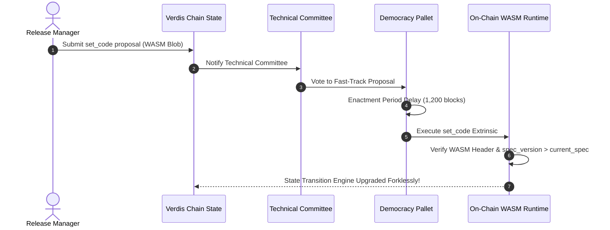

# VERDIS GOVERNANCE DOCUMENT 09: RELEASE STANDARDS

**Document Reference:** VERDIS-GOV-09  
**Status:** PERMANENT GOVERNANCE STANDARD  
**Version:** 1.0.0  
**Ratified:** August 5, 2026  
**Scope:** Versioning Schemes, Release Pipelines, Quality Gates, Production Deployment, Rollback Playbooks, Post-Release Monitoring, and Emergency Hotfixes across the Verdis Ecosystem.

---

## 1. OVERVIEW AND MANDATE

### 1.1 Purpose
This document establishes the permanent release standards and deployment protocols for the Verdis Ecosystem. To maintain maximum stability, state integrity, and zero-downtime reliability, no artifact, binary, smart contract, or container may be deployed to production without completing the 9-step GPT-4o CTO quality gate pipeline and obtaining a formal GO verdict.

### 1.2 Scope
These release standards apply to all software components supporting the seven core Verdis products:
1. **Verdis Chain** (Consensus Node, Substrate WASM Runtime, RPC Gateway, Bridges)
2. **AegisOS Engine** (AI CTO, Agent Runtime, Quality Gate Engine, Worker Pool)
3. **Verdis Applications** (Web Wallet, Explorer, Mobile Android/iOS, Desktop Clients)
4. **Verdis Trust Layer** (Identity Verification, Key Signers, Audit Logs)
5. **Verdis Developer Cloud** (Container Platform, RPC Hosting, CI/CD Engine)
6. **Verdis Marketplace** (Registry Server, Plugin Catalog, Extension Engine)
7. **Verdis Developer Platform** (SDKs, CLI Tools, REST & GraphQL API Gateways)

---

## 2. VERSIONING STANDARDS

All software artifacts in the Verdis Ecosystem follow strict versioning conventions to ensure predictable upgrades and compatibility.

### 2.1 Semantic Versioning 2.0.0 (Standard Components)
Applications, SDKs, CLI tools, microservices, and front-end web apps adhere strictly to Semantic Versioning 2.0.0 (`MAJOR.MINOR.PATCH`):
- **MAJOR (`X.0.0`)**: Incompatible API changes, breaking state migrations, or major architectural overhauls.
- **MINOR (`0.Y.0`)**: Backwards-compatible new features, new API endpoints, or pallet additions.
- **PATCH (`0.0.Z`)**: Backwards-compatible bug fixes, security patches, or performance optimizations.

### 2.2 Substrate WASM Runtime Dual Versioning
Because the Verdis Layer-1 Blockchain utilizes on-chain WASM runtime upgrades, state transition logic requires dual version tracking:

```rust
pub const VERSION: RuntimeVersion = RuntimeVersion {
    spec_name: create_runtime_str!("verdis-runtime"),
    impl_name: create_runtime_str!("verdis-runtime-impl"),
    authoring_version: 1,
    spec_version: 1020,  // On-chain state transition logic version
    impl_version: 1,     // Execution engine optimization version
    apis: RUNTIME_API_VERSIONS,
    transaction_version: 1,
    state_version: 1,
};
```

1. **`spec_version` Rules**:
   - Must be incremented whenever state storage schemas change, transaction dispatch logic changes, consensus rules change, or breaking API changes are introduced.
   - An increment in `spec_version` triggers a native forkless WASM runtime upgrade via governance extrinsic (`set_code`).
2. **`impl_version` Rules**:
   - Incremented for non-breaking internal execution optimizations or refactoring that do not alter state transitions or storage layouts.

---

## 3. THE MANDATORY 9-STEP GPT-4O CTO QUALITY GATE PIPELINE

Every release candidate branch (`release/v*`) must pass through all 9 automated quality gates in sequential order. A failure at any gate halts the release pipeline immediately.

```
+-----------------------------------------------------------------------+
| GATE 1: Static Analysis & Code Quality (Clippy, ESLint, Prettier)     |
+-----------------------------------------------------------------------+
                                   |
                                   v
+-----------------------------------------------------------------------+
| GATE 2: 100% Automated Test Suite Pass (Unit, Integration, E2E)      |
+-----------------------------------------------------------------------+
                                   |
                                   v
+-----------------------------------------------------------------------+
| GATE 3: Security Scan & Dependency Audit (Cargo audit, SAST)          |
+-----------------------------------------------------------------------+
                                   |
                                   v
+-----------------------------------------------------------------------+
| GATE 4: Performance & TPS Benchmarking Verification                   |
+-----------------------------------------------------------------------+
                                   |
                                   v
+-----------------------------------------------------------------------+
| GATE 5: Architecture Correctness Audit (GPT-4o Review)               |
+-----------------------------------------------------------------------+
                                   |
                                   v
+-----------------------------------------------------------------------+
| GATE 6: Documentation Integrity & Code Example Check                  |
+-----------------------------------------------------------------------+
                                   |
                                   v
+-----------------------------------------------------------------------+
| GATE 7: Deterministic Build & Artifact Checksum Verification          |
+-----------------------------------------------------------------------+
                                   |
                                   v
+-----------------------------------------------------------------------+
| GATE 8: Staging Deployment & Automated E2E Smoke Testing             |
+-----------------------------------------------------------------------+
                                   |
                                   v
+-----------------------------------------------------------------------+
| GATE 9: Final GPT-4o CTO Verdict Engine (Formal GO / NO-GO)           |
+-----------------------------------------------------------------------+
```

### 3.1 Detailed Execution Commands for Quality Gates

#### Gate 1: Static Analysis & Code Formatting
```bash
# Rust static analysis
cargo fmt --check
cargo clippy --all-targets --all-features -- -D warnings

# TypeScript / Front-end static analysis
npm run lint
npm run format:check
```

#### Gate 2: Test Suite Execution
```bash
# Rust unit and pallet tests
cargo test --workspace --all-features

# Substrate runtime integration tests
cargo test --package verdis-runtime --test integration_tests

# Front-end E2E Playwright tests
npm run test:e2e
```

#### Gate 3: Security Vulnerability Scanning
```bash
# Rust dependency advisory check
cargo audit

# Node / NPM security audit
npm audit --audit-level=high

# Static Application Security Testing (SAST)
semgrep --config p/ci .
```

#### Gate 4: Performance & Benchmarking Check
```bash
# Substrate pallet benchmarking execution
cargo run --profile=production --features=runtime-benchmarks --   benchmark pallet --chain=dev --pallet="*" --extrinsic="*" --steps=50 --repeat=20
```

#### Gate 5: GPT-4o Architecture Review
Executes the `verdis-cto-review` skill to evaluate architecture compliance against `VERDIS_CONSTITUTION.md` and design specifications.

#### Gate 6: Documentation Verification
```bash
# Validate Rustdoc doctests
cargo test --doc

# Check for broken links
markdown-link-check -c .markdown-link-check.json docs/**/*.md
```

#### Gate 7: Deterministic Build Check
```bash
# Deterministic build execution
cargo build --release --locked --bin verdis-node
sha256sum target/release/verdis-node > checksums.txt
gpg --detach-sign --armor checksums.txt
```

#### Gate 8: Staging Environment Deployment
Deploys build artifact to isolated staging environment container on host `91.98.160.145` and runs synthetic transaction workloads for 15 minutes.

#### Gate 9: Formal GPT-4o CTO Release Verdict
Gathers telemetry logs and test results from Gates 1-8. If zero Critical or High findings exist, generates a signed `release-verdict.json` with a GO status.

### 3.2 Canonical `release-verdict.json` Schema Example

```json
{
  "release_id": "v1.2.0-rc3",
  "timestamp": "2026-08-05T09:28:00Z",
  "target_branch": "release/v1.2.0",
  "commit_hash": "c7a91b409e234211b84182ff3023a10123456789",
  "gate_results": {
    "gate_1_static_analysis": { "status": "PASSED", "warnings": 0 },
    "gate_2_tests": { "status": "PASSED", "total_tests": 1420, "failed": 0 },
    "gate_3_security": { "status": "PASSED", "critical_vulnerabilities": 0 },
    "gate_4_benchmarks": { "status": "PASSED", "measured_tps": 2450 },
    "gate_5_architecture": { "status": "PASSED", "findings": [] },
    "gate_6_documentation": { "status": "PASSED", "doc_coverage_pct": 100.0 },
    "gate_7_build": { "status": "PASSED", "sha256": "8f3a2b91c02e4f7a..." },
    "gate_8_staging": { "status": "PASSED", "e2e_pass_pct": 100.0 }
  },
  "gpt_4o_cto_verdict": {
    "decision": "GO",
    "approval_code": "GPT-VERDIS-GO-20260805-120",
    "signature": "0x3045022100a98f1234..."
  }
}
```

---

## 4. ZERO-DOWNTIME DATABASE MIGRATION STANDARDS

For relational databases (PostgreSQL/SQLite) and state stores, schema migrations must follow the 5-phase Expand/Contract strategy to eliminate downtime:

1. **Phase 1 (Expand)**: Add new database columns or tables as nullable or with default values. Do NOT drop or rename existing columns.
2. **Phase 2 (Dual Write)**: Deploy application code that reads from old schema but writes to both old and new schema fields simultaneously.
3. **Phase 3 (Backfill)**: Run asynchronous background migration job to populate new column for historical rows.
4. **Phase 4 (Read Switch)**: Update application code to read from the new column.
5. **Phase 5 (Contract)**: After 48 hours of successful production observation, remove old columns/tables in a subsequent release.

---

## 5. FEATURE FLAGS & DARK LAUNCHING

Complex user-facing features or new API paths must be wrapped in dynamic feature flags to allow dark launching and instant kill-switch toggling without redeploying binaries.

```typescript
// Feature Flag Evaluation Pattern
if (FeatureFlagManager.isEnabled(ENABLE_EBPF_PARALLEL_VERIFIER, userContext)) {
  await executeParallelVerifier();
} else {
  await executeStandardVerifier();
}
```

- **Default State**: New feature flags must default to `DISABLED` in production.
- **Rollout Strategy**: Flags are incrementally toggled via AegisOS Cloud Console (`cloud.verdis.network`) to 5% -> 25% -> 100% of user traffic.

---

## 6. RELEASE SIGNING & KEY MANAGEMENT

To guarantee artifact provenance and prevent supply chain attacks, all release binaries, WASM blobs, containers, and installers must be cryptographically signed.

1. **GPG Release Key**: Private signing key (`verdis-release-master.key`) stored strictly within hardware security module (HSM) or encrypted Vault.
2. **Signature Verification**: Every release manifest is accompanied by `checksums.txt.asc`. Integrators verify using:
   ```bash
   gpg --verify checksums.txt.asc checksums.txt
   sha256sum -c checksums.txt
   ```

---

## 7. MOBILE & DESKTOP APPLICATION RELEASE STANDARDS

Mobile and desktop clients across the Verdis Ecosystem follow platform-specific release rules:

### 7.1 Android (APK / Android App Bundle AAB)
- **Signing**: Signed with release keystore managed by Vault key manager (`verdis-android-release.keystore`).
- **Staged Rollout**: Deployed to Google Play Store using staged rollout: 5% -> 20% -> 50% -> 100% over 5 days.

### 7.2 iOS (IPA / TestFlight)
- **Code Signing**: Automatic provisioning using Apple Developer Enterprise distribution certificate.
- **Flight Verification**: Uploaded to TestFlight for 24-hour internal beta testing prior to App Store release.

### 7.3 Desktop Clients (Windows / macOS / Linux)
- **Windows**: Built via Tauri / Electron, signed with EV Code Signing Certificate (`.msi`, `.exe`).
- **macOS**: Signed and notarized via Apple Notarization Service (`.dmg`, `.app`).
- **Linux**: Distributed as AppImage (`.AppImage`) and Debian package (`.deb`).

---

## 8. RELEASE CADENCE & COMMUNICATION MATRIX

Releases follow a structured train schedule to ensure predictability for node operators and developers.

### 8.1 Release Train Schedule
| Release Type | Cadence / Schedule | Target Audience | Approval Requirement |
| :--- | :--- | :--- | :--- |
| **Major Releases** | Quarterly (Every 3 months) | Entire Ecosystem | Governance Referendum & GPT-4o CTO GO |
| **Minor Releases** | Bi-weekly (Every 2nd Tuesday) | Developers, Node Operators | Full 9-Step GPT-4o Pipeline Pass |
| **Patch Builds** | As needed (Daily max 1) | End Users, App Integrators | Gate 1-3 & 7-9 Pass |
| **Security Hotfix** | Emergency (< 2 hours) | Infrastructure Nodes | Expedited 3-Step Security Pipeline |

### 8.2 Public Communication Channels
Upon successful production deployment, automated webhooks publish release summaries to:
1. **GitHub Releases**: Full release notes, binary downloads, `checksums.txt.asc`.
2. **Verdis Status Page**: Status update at `status.verdis.network`.
3. **Developer Portal Blog**: Technical writeup on `blog.verdis.network`.
4. **Developer Webhook Feed**: Push JSON payload to subscriber endpoints.

---

## 9. ON-CHAIN WASM GOVERNANCE UPGRADE WORKFLOW

For blockchain runtime upgrades, the release pipeline produces an optimized WASM blob (`verdis_runtime.compact.compressed.wasm`) which is submitted via on-chain governance:



---

## 10. ARTIFACT REPOSITORY & BINARY STORAGE SPECIFICATIONS

Release artifacts must be archived deterministically in release storage directories and artifact registries.

### 10.1 Server Release Directory Layout (`91.98.160.145`)
```
/opt/verdis/
├── current -> /opt/verdis/releases/v1.2.0  (Atomic Symlink)
├── previous -> /opt/verdis/releases/v1.1.9 (Rollback Symlink)
└── releases/
    ├── v1.1.8/
    ├── v1.1.9/
    └── v1.2.0/
        ├── verdis-node
        ├── verdis_runtime.compact.compressed.wasm
        ├── checksums.txt
        ├── checksums.txt.asc
        └── web/
            ├── index.html
            └── static/
```

### 10.2 Docker Image Tagging Rules
All Docker images pushed to the internal or public registry must include both semantic version tags and git commit SHAs:
- `verdis/chain-node:1.2.0` (Semantic Version Tag)
- `verdis/chain-node:1.2.0-c7a91b4` (Version + Commit SHA Tag)
- `verdis/chain-node:latest` (Pointers to latest stable release tag, strictly forbidden in production compose manifests)

---

## 11. PRE-RELEASE CHECKLIST

Prior to executing the production deployment pipeline, the release manager (or automated AegisOS Release Agent) must verify the following checklist:

```markdown
### Official Verdis Pre-Release Verification Checklist

- [ ] **Branch Target**: Release candidate merged into `release/vX.Y.Z` branch.
- [ ] **Gate 1-8 Pass**: CI pipeline logs confirm Gate 1 through Gate 8 executed with 100% success.
- [ ] **Runtime Version Bumped**: If chain runtime changed, `spec_version` in `runtime/src/lib.rs` incremented.
- [ ] **Database Migrations Tested**: SQL and state schema migration scripts executed on staging data copy without errors.
- [ ] **Artifact Checksum Signed**: Release binaries hashed (`sha256sum`) and cryptographically signed with release key.
- [ ] **Documentation Published**: API references updated on `docs.verdis.network`.
- [ ] **Changelog Updated**: `CHANGELOG.md` updated with release highlights under `[X.Y.Z]`.
- [ ] **Rollback Plan Validated**: Previous release artifact backup verified in `/opt/verdis/releases/previous/`.
- [ ] **Gate 9 Verdict Obtained**: Signed GPT-4o CTO GO verdict output stored in `reviews/release-vX.Y.Z-verdict.json`.
```

---

## 12. PRODUCTION DEPLOYMENT PROCEDURE

All production deployments to host `91.98.160.145` are automated through continuous deployment scripts executing over secure SSH.

### 12.1 Deployment Commands & Execution Sequence

```bash
#!/usr/bin/env bash
# Production Deployment Execution Script: deploy_v1.2.0.sh
set -euo pipefail

HOST="91.98.160.145"
DEPLOY_USER="verdis-deploy"
RELEASE_VERSION="v1.2.0"
RELEASE_DIR="/opt/verdis/releases/${RELEASE_VERSION}"
CURRENT_LINK="/opt/verdis/current"

echo "=== STAGE 1: Connecting to Production Host ${HOST} ==="
ssh ${DEPLOY_USER}@${HOST} "mkdir -p ${RELEASE_DIR}"

echo "=== STAGE 2: Uploading Verified Release Artifacts ==="
scp target/release/verdis-node ${DEPLOY_USER}@${HOST}:${RELEASE_DIR}/verdis-node
scp -r dist/* ${DEPLOY_USER}@${HOST}:${RELEASE_DIR}/web/

echo "=== STAGE 3: Atomic Symlink Swap & Service Reload ==="
ssh ${DEPLOY_USER}@${HOST} << "ENDSSH"
    # Update symlink atomically
    ln -sfn ${RELEASE_DIR} ${CURRENT_LINK}

    # Reload systemd services
    sudo systemctl reload verdis-chain.service
    sudo systemctl reload verdis-aegisos.service

    # Reload Nginx reverse proxy
    sudo nginx -t && sudo systemctl reload nginx
ENDSSH

echo "=== STAGE 4: Automated Production Health Verification ==="
sleep 5
HTTP_CODE=$(curl -s -o /dev/null -w "%{http_code}" https://rpc.verdis.network/health)
if [ "${HTTP_CODE}" -eq 200 ]; then
    echo "SUCCESS: Production health check passed (HTTP 200)."
else
    echo "ERROR: Health check failed with status ${HTTP_CODE}! Triggering automatic rollback..."
    ./rollback_production.sh
    exit 1
fi
```

---

## 13. ROLLBACK PROCEDURES & PLAYBOOKS BY COMPONENT

If post-deployment smoke tests fail or critical runtime errors occur within the initial observation window, execute the component-specific rollback playbook immediately.

| Component | Primary Rollback Action | Execution Mechanism | Target Recovery Time (RTO) |
| :--- | :--- | :--- | :--- |
| **Verdis Chain Binary** | Atomic Symlink Swap | `ln -sfn /opt/verdis/releases/v1.1.9 /opt/verdis/current` | < 10 seconds |
| **WASM Runtime** | On-chain `set_code` re-upgrade | Submit prior WASM blob with `spec_version + 1` | < 2 minutes |
| **Web Applications** | Nginx Upstream Switch | `nginx -s reload` pointing to prior build directory | < 2 seconds |
| **PostgreSQL Schema** | Execute SQL down-migration script | `psql -f migrations/V1.2.0__rollback.sql` | < 30 seconds |

### 13.1 Standard Service Rollback Script (`rollback_production.sh`)

```bash
#!/usr/bin/env bash
set -euo pipefail

HOST="91.98.160.145"
DEPLOY_USER="verdis-deploy"
PREVIOUS_RELEASE=$(ssh ${DEPLOY_USER}@${HOST} "ls -td /opt/verdis/releases/v* | sed -n 2p")

echo "=== INITIATING EMERGENCY ROLLBACK ==="
echo "Rolling back to previous release: ${PREVIOUS_RELEASE}"

ssh ${DEPLOY_USER}@${HOST} << "ENDSSH"
    # Revert symlink to previous release
    ln -sfn ${PREVIOUS_RELEASE} /opt/verdis/current

    # Restart core services
    sudo systemctl restart verdis-chain.service
    sudo systemctl restart verdis-aegisos.service
    sudo systemctl reload nginx

    # Verify rollback health
    curl -f http://localhost:9933/health || exit 1
ENDSSH

echo "Rollback completed successfully."
```

### 13.2 Emergency Chain State Rollback Protocol (State Storage Purge)
If an invalid state transition occurs on the blockchain layer due to a consensus bug:
1. Halt validator node execution (`systemctl stop verdis-chain.service`).
2. Purge invalid block state back to last known good finalized block header (`verdis-node purge-chain --rollback-to-block <BLOCK_NUM>`).
3. Deploy corrected WASM runtime or binary patch.
4. Restart validator service (`systemctl start verdis-chain.service`) and verify block production resumption.

---

## 14. POST-RELEASE OBSERVATION WINDOW (24-HOUR WATCH)

Following every production release, the service enters a 24-hour mandatory post-release observation window managed by Prometheus alerting and AegisOS monitoring agents.

### 14.1 Key Telemetry Metrics Monitored During Watch
- **Block Production Stability**: Missed BABE consensus slots must remain 0.
- **Memory & Resource Leak Detection**: Process RSS memory growth checked for linear leaks.
- **Transaction Pool Backlog**: Mempool depth monitored for stuck extrinsics.
- **HTTP/WSS Error Rates**: Nginx 5xx error rate must remain below 0.01%.

---

## 15. EMERGENCY HOTFIX RELEASE PROCESS & POST-MORTEMS

When a Critical security vulnerability (e.g., zero-day exploit, reentrancy bug, key leak) is identified in production, the standard release timeline is superseded by the Expedited Hotfix Pipeline.

### 15.1 Expedited Hotfix Pipeline (3-Step Fast Gate)
1. **Targeted Security Fix**: Developer creates patch branch `hotfix/CVE-YYYY-XXXX`.
2. **Fast-Track Gate Verification**:
   - Step A: Security scan & targeted unit test pass (`cargo test`).
   - Step B: Focused GPT-4o CTO Security Review (`verdis-cto-review`).
3. **Emergency Deploy & Advisory**:
   - Immediate SSH deployment to `91.98.160.145`.
   - Publish encrypted security advisory to node operators.
   - Conduct mandatory post-mortem incident report within 48 hours.

### 15.2 Incident Post-Mortem Standard Template
Every post-mortem document must be saved in `docs/post-mortems/YYYY-MM-DD-<incident-title>.md` containing:
- **Incident Summary**: Root cause, severity level, duration of outage.
- **Timeline**: Chronological sequence of event identification, diagnosis, mitigation, and resolution.
- **Root Cause Analysis**: Deep technical breakdown of failure mechanism.
- **Preventative Action Items**: Engineering tasks to prevent recurrence, assigned to specific quality gates.

---

## 16. RELEASE GOVERNANCE CHECKLIST

Before any release tag is published to GitHub or deployed to production, confirm:

- [ ] **9-Step Quality Pipeline Passed**: Every gate from Gate 1 to Gate 8 shows 100% green status.
- [ ] **Signed GPT-4o Verdict**: Formal GO decision verdict JSON file generated and cryptographically signed.
- [ ] **Artifact Signatures Generated**: SHA-256 checksum file signed with Verdis Release Key.
- [ ] **Database Migrations Tested**: Expand/Contract zero-downtime migration strategy followed.
- [ ] **Symlink Swap Ready**: Target deployment directory prepared on `91.98.160.145`.
- [ ] **Rollback Verified**: Pre-release snapshot available in `/opt/verdis/releases/previous/`.
- [ ] **Mobile & Desktop Assets Signed**: Android AAB, iOS IPA, Windows MSI signed with production certificates.
- [ ] **Public Announcements Prepared**: Webhooks configured for GitHub Releases, Status Page, and Blog.
- [ ] **24-Hour Watch Scheduled**: Monitoring team and AegisOS telemetry alerts configured for post-release tracking.
